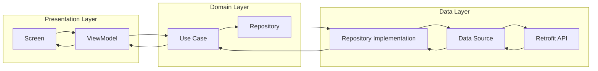

# ⚔️ Urithiru Project
**One project to rule them all.**

A modular Android application template built with Clean Architecture principles.  
Designed to be scalable, maintainable, and easy to extend — even for beginners.

## 🧰 Tech Stack
* Jetpack Compose for UI creation
* Retrofit for API call
* Hilt for dependency injection
* Kotlin Coroutines for asynchronous programming

## 📦 Prerequisites

* Gradle 9.3.1
* JDK 21
* Minimum Android SDK 24

## 🧱 Project Modules

The project contains the following modules:

* `:api-a`
* `:api-b`
* `:app`
* `:buildlogic`
* `:core`
* `:core-entity`
* `:core-navigation`
* `:core-ui`
* `:feature-a`
* `:feature-b`
* `:feature-splash`

## 🏗 Architecture Flow



## ⚙️ Development Guide

### 1️⃣ Changing the Base URL

The Base URL is managed per environment using property files in the `productFlavorProperties` folder.

1.  Navigate to `productFlavorProperties/`.
2.  Open the file corresponding to the environment you want to change (e.g., `dev.properties`, `prod.properties`).
3.  Update the `BASE_URL` value:
    ```properties
    BASE_URL=https://your-new-api-url.com/api/
    ```
4.  Sync the project with Gradle. The `BuildConfig.BASE_URL` will be updated automatically.

### 2️⃣ Creating a New API Endpoint

To add a new API call, follow these steps (using the `api-a` module as an example):

#### Step A: Define the Data Transfer Object (DTO)
Create your response model in `api-a/src/main/java/.../data/remote/dto/`.

```kotlin
data class YourResponse(
    val id: String,
    val name: String
)
```

#### Step B: Add the API Interface
Create new API interface (e.g., `YourApi.kt`) and add the endpoint function.

```kotlin
interface YourApi {
    @GET
    suspend fun getYourData(
        @Url url: String
    ): Response<ApiDto<YourResponse>>
}
```

#### Step C: Update the Remote Data Source
Add the call to your `RemoteDataSource` interface and its implementation.

**Interface:**
```kotlin
suspend fun getYourData(): ApiResult<ApiDto<List<YourResponse>>>
```

**Implementation:**
```kotlin
override suspend fun getYourData(): ApiResult<ApiDto<WeaponResponse>> =
    getResult { api.getYourData("your/end/point") }
```

#### Step D: Expose through Repository and Use Case
Finally, expose the data through the Repository and create a Use Case to be consumed by the ViewModel in the `feature` module.
